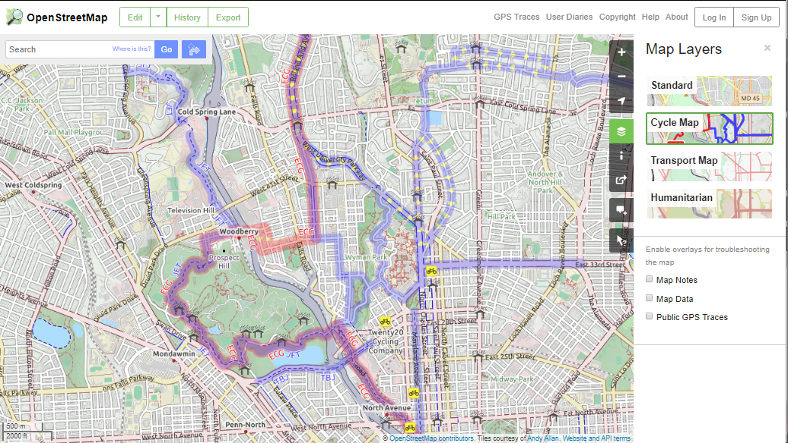
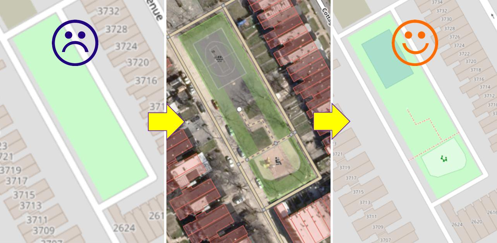
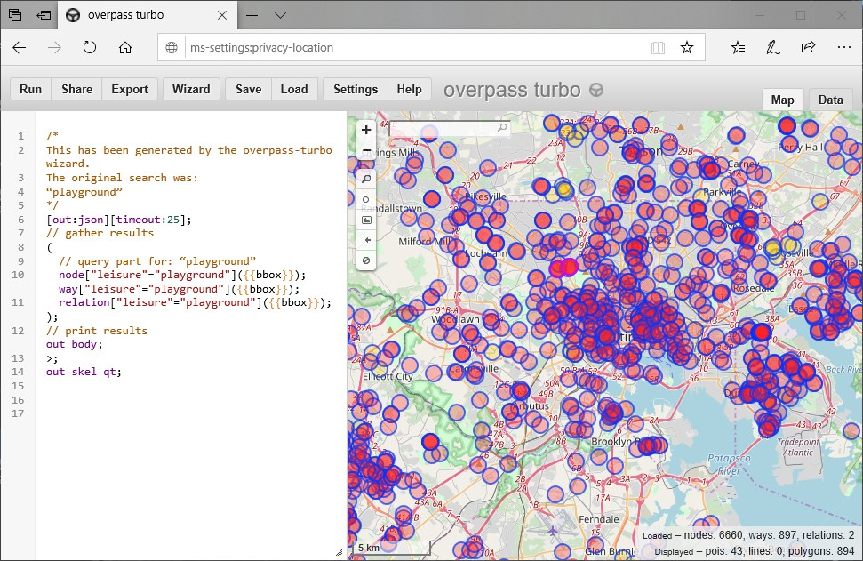
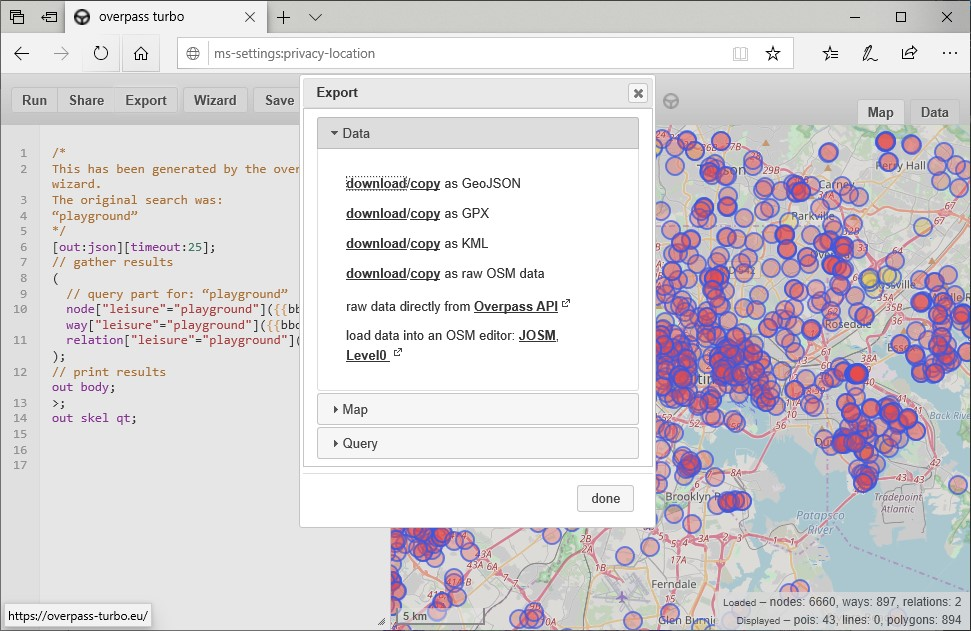
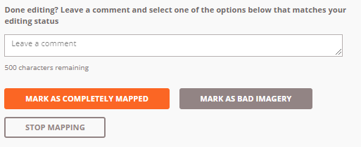

class: center, middle, inverse
# Introdcution to OpenStreetMap
MaptimeBmore<br>
[jonathan dandois](https://twitter.com/jondandois)


.footnote[This presesentation was made with [RemarkJS](https://github.com/gnab/remark)]

---
## Agenda
1. Introduction

1. The intersection of GIS and OSM

1. How to contribute to OSM (adding / editing data)

1. How to download and extract data from OSM

1. Resources

---
.left-column[
  ## Introduction
]
.right-column[
  OpenStreetMap is a **global open data portal**:
  - Free for everyone to use .red[*]
  - Anyone can add to it
  - You can download the data for your own project
  - Some say it's kind of like the *Wikipedia* of maps


  .image-middle[]<br>
  .font-small[[OpenStreetMap.org](https://Openstreetmap.org)]<br>
  .font-small[[OSM Welcome Mat: welcome.openstreetmap.org](https://welcome.openstreetmap.org/)]

  .footnote[.red[*] OSM has a license and OpenStreetMap.org does have usage limits, see: [Terms of Use](https://wiki.osmfoundation.org/wiki/Terms_of_Use)]
]

---
## Explore POIs
.image-width-max[]

---
## Customized cartography for different themes
.image-width-max[]

---
## Directions for car, bike, foot travel
.image-width-max[]

---
## Mobile apps
.image-width-max[]

---
### Multiple basemap themes - .font-small[for small Leaflet, OpenLayers, etc. projects]
.image-width-max[]
.font-small[https://leaflet-extras.github.io/leaflet-providers/preview/]

---
.left-column[
  ## Introduction
  ### Used by many groups
]
.right-column[
OpenStreetMap is used by people all over the world:
  - individuals
  - volunteers
  - companies (Apple, Esri, Facebook, ...)
  - nonprofits
  - governments
  - organizations
  - and more

There are many ways to use OpenStreetMap: as a basemap, using the OSM data for routing or navigation, using OSM data for GIS analysis, such as planning or logistics for humanitarian groups, utilities, governments and more.

.font-small[https://welcome.openstreetmap.org/about-osm-community/consumers/]
]

---
class: center, middle, inverse
# because...

---
class: center
# OpenStreetMap * **is not** just a basemap*
.image-width-max[]

---
.left-column[
  ## Introduction
]
.right-column[
  OpenStreetMap is a global **geodatabase** of<br>
  .underline[everything] and .underline[anything] that people add to the map:
  - roads, crosswalks, speed bumps, stop lights...
  - restuarants, daycares, playgrounds, cannons...
  - forests, central business districts, boundaries...
  - land cover, gravestones, utility ROWs...

.image-middle[]<br>
.font-small[Example of OSM data in the [JOSM editor](https://josm.openstreetmap.de/)]
.footnote[
  JOSM image credit: [Wikmedia Commons](https://commons.wikimedia.org/wiki/File:JOSM_screenshot_hoofdscherm.png)
]
]

---
## OpenStreetMap is **GIS** in action at a global scale.
.center[.image-large[]]<br>
.font-small[OSM edits in Wuhan 2020. [Rendering by Jeff Underwood Mar 3, 2020](https://twitter.com/jeffdefacto/status/1235066401745817600)]<br>
.font-small[https://wiki.openstreetmap.org/wiki/File:OSM_edits_in_Wuhan_2020.jpg]
---
.left-column[
  ## OSM & GIS
]
.right-column[
Editing in OSM for just a few minutes covers a huge range of what you learn about in a GIS program:
  ## Editing, digitizing, image interpretation
  ## Databases
  ## Metadata and attributes
  ## Data Quality (QA/QC)
]

---
.left-column[
  ## OSM & GIS
  ### Editing & Digitizing
  ### Image Interpretation
]
.right-column[
  Image interpretation and digitizing is a core component of contributing to OSM.
  - POIs, addresses (points)
  - Roads, sidewalks, paths (lines)
  - School areas, central business districts, parks, lakes, playgrounds (polygons)

Features are added to the map through on-screen digitizing from high-resolution aerial, satellite, and drone-based imagery by digitizing points, lines, and polygons.
.image-middle[]
]

---
.left-column[
  ## OSM & GIS
  ### Data & Geodatabases
  .image-middle[]
]
.right-column[
### Nodes: .font-small[Dots used to mark locations]
Nodes can be separate or can be connected.

### Ways: .font-small[A connected line of nodes]
Used to create roads, paths, rivers, and so on.  Ways can be open (lines), **closed** (closed loop, areas), **areas** (closed, filled in areas).

### Relates: .font-small[A group of elements]
Can be used to create more complex shapes, or to represent elements that are related but not physically connected. A grouping of elements and tags.

  .font-small[https://wiki.openstreetmap.org/wiki/Beginners_Guide_1.3]
]

---
.left-column[
  ## OSM & GIS
  ### Metadata & Attributes
  .image-tiny[]
]
.right-column[
## Tags
  - Tags are the .underline[attributes] for nodes, ways, and relates
  - Organized as Key:Value pairs
  - 10's of thousands of key tags across OSM

```ruby
  key: Highway =
  highway: motorway
  highway: primary
  highway: secondary
  highway: unclassified
  ...

  key: Leisure =
  leisure: bowling_alley
  leisure: maze
  leisure: playground
  ...
```
- And tags that are associated with other tags, including highway speed, playground surface, business operating hours, etc.

.font-small[https://wiki.openstreetmap.org/wiki/Tags]
]

---
.left-column[
  ## OSM & GIS
  ### Data Quality
]
.right-column[
  ## Data Quality
  Large collection of rules for maintaining quality of feature topology and attributes.
  .font-small[
- Ways that do not connect
- Missing key tags
- Overlapping buildings
- Duplicates
  ]
  .image-middle[]
  .font-small[https://wiki.openstreetmap.org/wiki/Quality_assurance]
]

---
## Data Quality
Data issues in iD Editor
.center[
  .image-width-max[]
]

---
## Data Quality
Data issues in iD Editor
.center[
  .image-width-max[]
]

---
.left-column[
  ## Contributing
  ### Editing
  .image-teeny-tiny[]
  .image-teeny-tiny[]
  .image-teeny-tiny[]
]
.right-column[
## Basic In-Browser Editing
- iD Editor https://wiki.openstreetmap.org/wiki/ID
- Quick editing, most Task Manager tasks

## Advanced Desktop Editing
- JOSM https://wiki.openstreetmap.org/wiki/JOSM
- Advanced editing of large areas, bulk uploads

## Mobile Editing
- Vespucci (Android) https://wiki.openstreetmap.org/wiki/Vespucci
- GoMap!! (iOS) https://wiki.openstreetmap.org/wiki/Go_Map!!

]

---
.left-column[
  ## Contributing
  ### Task Managers
.left[
  .image-tiny[]
  .image-tiny[]
]
]
.right-column[
## US Tasking Manager
Communities, organizations and governments nationwide have access to these maps to navigate our country and address local challenges. OSM US Tasks help improve the map to help address local challenges.<br>
.font-small[https://tasks.openstreetmap.us/]<br>
.font-small[https://www.openstreetmap.us/]

## Humanitarian OSM Team (HOT)
Contribute to global mapping projects to .underline[address local development challenges and aid disaster response.]<br>
.font-small[https://tasks.hotosm.org/]

HOT is an international team dedicated to humanitarian action and community development through open mapping.<br>
.font-small[https://www.hotosm.org/]
]

---
.left-column[
  ## Downloading
]
.right-column[
  .image-tiny[]
  ## Overpass API
The Overpass API provides quick access to OSM features based on a query language.

## QuickOSM: .font-small[QGIS Plugin]
.font-small[https://plugins.qgis.org/plugins/QuickOSM/]
## OSMQuery: .font-small[ArcMap and Pro Python toolbox]
.font-small[https://github.com/riccardoklinger/OSMquery]
]

---
.left-column[
  ## Downloading
]
.right-column[
  ## Overpass Turbo
  The easiest way to get familiar with it is through the Overpass-Turbo site https://overpass-turbo.eu/
```javascript
/*
  This has been generated by the overpass-turbo wizard.
  The original search was:
  “playground”
*/
[out:json][timeout:25];
// gather results
(
  // query part for: “playground”
  node["leisure"="playground"]({{bbox}});
  way["leisure"="playground"]({{bbox}});
  relation["leisure"="playground"]({{bbox}});
);
// print results
out body;
>;
out skel qt;
```
Export queries to GeoJSON, KML and other formats for use in Desktop GIS.
]

---
### Overpass Turbo query: .font-small[playgrounds in Baltimore]
.image-width-max[]

---
### Overpass Turbo query: .font-small[playgrounds in Baltimore]
.image-width-max[]


---
.left-column[
  ## Downloading
]
.right-column[
 ## And other ways to download data
https://wiki.openstreetmap.org/wiki/Downloading_data

Including the whole Planet... https://planet.openstreetmap.org/
]

---
## Let's get mapping!
### Getting started: login and walkthrough
.font-small-middle[
1. Go to OpenStreetMap.org and Login (register if needed)
1. Click `Edit` in the upper-left and take the Walkthrough
1. If Walkthrough is hidden: select Help on the right, and "Start the Walkthrough"
]

### Do some editing
.font-small-middle[
1. Go to https://tasks.openstreetmap.us or https://tasks.hotosm.org
1. Pick a task that is at the **BEGINNER** level with a low **% Mapped**
1. Read Instructions, then: Map, Select A Random Task, Start Mapping, iD Editor Start Editing.
1. When done editing in iD Editor **review** and **save** your edits, tag with #maptimebmore, then return to the Task page and select one of the options to stop editing.
.image-small[]
]

---
## Download and view
.font-small-middle[
1. Go to overpass-turbo.eu

1. Zoom to your area of interest

1. Use the **Wizard** 🧙‍ to build out a query and run it

1. Download as GeoJSON

1. Use **ArcGIS Pro JSON Toolset** to import as a feature class https://pro.arcgis.com/en/pro-app/tool-reference/conversion/json-to-features.htm

1. Explore data, create a visualization, download more data.

1. Or, try doing all this with OSMQuery .font-small[https://github.com/riccardoklinger/OSMquery]

]


---
## Thank you!
### Resources
- OSM Wiki: https://wiki.openstreetmap.org/
- LearnOSM: https://learnosm.org/
- TeachOSM: https://teachosm.org/

### Follow MaptimeBmore
https://www.meetup.com/maptime_bmore/<br>
https://twitter.com/MaptimeBmore

View this presentation at:<br>
[https://github.com/maptimebmore/ccbc-osm-presentation](https://github.com/maptimebmore/ccbc-osm-presentation)
