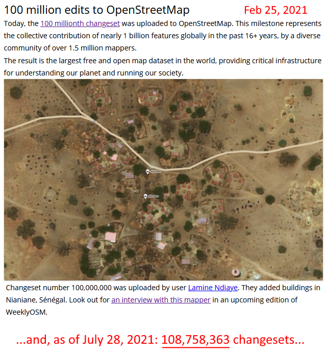
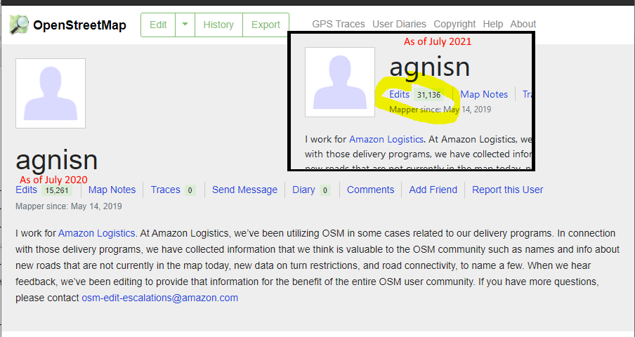

class: center, middle, inverse
# Introduction to OpenStreetMap
[jonathan dandois](https://twitter.com/jondandois)

[@MaptimeBmore](https://twitter.com/MaptimeBmore)


.footnote[This presesentation was made with [RemarkJS](https://github.com/gnab/remark)]

---
class: center, middle, inverse
# *What is OpenStreetMap?*

---
class: center
# You might know OpenStreetMap like this
.image-width-max[]

---
class: center
# OpenStreetMap * **is not** just a basemap*
.image-width-max[]

---
.left-column[
  ## Introduction
]
.right-column[
  OpenStreetMap is a **global geodatabase** of<br>
  .underline[everything] and .underline[anything] that people add to the map:
  - roads, crosswalks, speed bumps, stop lights...
  - restuarants, daycares, playgrounds, cannons...
  - forests, central business districts, boundaries...
  - land cover, gravestones, utility ROWs...

.image-middle[]<br>
.font-small[Example of OSM data in the [JOSM editor](https://josm.openstreetmap.de/)]
.footnote[
  JOSM image credit: [Wikmedia Commons](https://commons.wikimedia.org/wiki/File:JOSM_screenshot_hoofdscherm.png)
]
]

---
.left-column[
  ## Introduction
]
.right-column[
  OpenStreetMap is:
  - Free for everyone to use .red[*]
  - Anyone can add to it
  - You can download the data for your own work
  - Some say it's kind of like the *Wikipedia* of maps


  .image-middle[]<br>
  .font-small[[OpenStreetMap.org](https://Openstreetmap.org)]<br>
  .font-small[[OSM Welcome Mat: welcome.openstreetmap.org](https://welcome.openstreetmap.org/)]

  .footnote[.red[*] OSM has a license and OpenStreetMap.org does have usage limits, see: [Terms of Use](https://wiki.osmfoundation.org/wiki/Terms_of_Use)]
]


---
## OpenStreetMap is **GIS** in action at a global scale.
.center[.image-large[]]<br>
.font-small[The 100 Millionth Changeset is added to OpenStreetMap Feb 25, 2021]<br>
.font-small[https://blog.openstreetmap.org/2021/02/25/100-million-edits-to-openstreetmap/]<br>
.font-small[https://www.openstreetmap.org/changeset/100000000#map=19/14.42623/-16.42198]

---
.left-column[
  ## OSM & GIS
  ### Data & Geodatabases
  .image-middle[]
]
.right-column[
### Nodes: .font-small[.underline[Points] used to mark locations]
Nodes can be separate or can be connected.

### Ways: .font-small[Connected nodes forming .underline[lines and polygons]]
Used to create roads, paths, rivers, and so on.  Ways can be open (lines), **closed** (closed loop, areas), **areas** (closed, filled in areas).

### Relates: .font-small[.underline[Relationships] among groups of nodes & ways]
Can be used to create more complex shapes, or to represent elements that are related but not physically connected. A grouping of elements and tags.

  .font-small[https://wiki.openstreetmap.org/wiki/Beginners_Guide_1.3]
]

---
.left-column[
  ## OSM & GIS
  ### Attributes
  .image-tiny[]
]
.right-column[
## Tags
  - Tags are the .underline[attributes] for nodes, ways, and relates
  - Organized as Key:Value pairs
  - 10's of thousands of key tags across OSM

```ruby
  key: Highway =
  highway: motorway
  highway: primary
  highway: secondary
  highway: unclassified
  ...

  key: Leisure =
  leisure: bowling_alley
  leisure: maze
  leisure: playground
  ...
```
- And tags that are associated with other tags, including highway speed, playground surface, business operating hours, etc.

.font-small[https://wiki.openstreetmap.org/wiki/Tags]
]

---
.left-column[
  ## OSM & GIS
  ### Metadata
]
.right-column[
  ## Changesets
  - A **changeset** is the .underline[data about the data]
  - Changes made by a user during an edit session
    - Adding / removing elements
    - Editing nodes/ways/relates
    - Updating attribute tags
  - May represent a single edit or a group of edits


  The map of 2020 edits in Wuhan was made by downloading and analysing changeset data<br>
  .image-small[]


  .footnote[https://wiki.openstreetmap.org/wiki/Changeset]
]


---
## Explore POIs
.image-width-max[]
---
## Directions for car, bike, foot travel
.image-width-max[]

---
## Mobile apps
.image-width-max[]

---
### Multiple basemap themes - .font-small[for small Leaflet, OpenLayers, etc. projects]
.image-width-max[]
.font-small[https://leaflet-extras.github.io/leaflet-providers/preview/]

---
## Explore Landuse Landcover Globally
.image-width-max[]
.font-small[https://osmlanduse.org/]


---
.left-column[
  ## Used by many groups
]
.right-column[
OpenStreetMap is used by people all over the world:
  - individuals
  - volunteers
  - companies (Apple, **Amazon**, Facebook, **Esri**,...)
  - nonprofits
  - governments
  - organizations
  - and more

There are many ways to use OpenStreetMap: as a basemap, using the OSM data for routing or navigation, using OSM data for GIS analysis, such as planning or logistics for humanitarian groups, utilities, governments and more.

.image-width-max[]
.font-small[https://welcome.openstreetmap.org/about-osm-community/consumers/]
.font-small[https://wiki.openstreetmap.org/wiki/Organised_Editing/Activities]

]

---
### Esri & Facebook investing heavily in OSM
.image-width-max[]
.font-small[https://www.esri.com/arcgis-blog/products/arcgis-living-atlas/mapping/arcgis-data-support-in-osm-editors/]

---
### Facebook RapiD Editor - Partnership w/ Esri, Microsoft, OSM
.image-width-max[]
.font-small[https://mapwith.ai/rapid#map=17.34/38.33719/-75.11570]

---
### Amazon Logistics - Editing OSM daily
.image-width-max[]
.font-small[https://wiki.openstreetmap.org/wiki/Organised_Editing/Activities/Amazon]


---
### Amazon Logistics - Editing OSM daily
.image-width-max[]
.font-small[https://www.openstreetmap.org/user/agnisn]

---
class: center, middle, inverse
# So, it’s open, community data.
## Can I trust it?


---
# YES!
OpenStreetMap has a huge quality control protocol and highly engaged reviewers that are both automated and working manually all the time, all over the world.
- **“Naughty Word”** lists published in dozens of languages to flag griefers

- Suspected **“Pokemon”** edits, which may be valid or invalid

- **Geometry errors** (topology, irregular shapes, roads not connecting)

- Screening any **new editor**

- Changes to **large or primary features** like landmarks, lakes, major roads

- Changes to borders, names of cities, towns, countries

- Updated data on roads, buildings, shops, etc. constantly being added

.footnote[https://wiki.openstreetmap.org/wiki/Quality_assurance]

---
.left-column[
  ## OSM & GIS
  ### Data Quality
]
.right-column[
  ## Data Quality
  Large collection of rules for maintaining quality of feature topology and attribute quality.
  .font-small[
- Ways that do not connect
- Missing key tags
- Overlapping buildings
- Duplicates
  ]
  .image-middle[]
  .font-small[https://wiki.openstreetmap.org/wiki/Quality_assurance]
]

---
## Data Quality
Data issues in iD Editor
.center[
  .image-width-max[]
]

---
## Data Quality
Data issues in iD Editor
.center[
  .image-width-max[]
]

---
## Data Quality .font-small[We must go deeper ⛏]
Whats wrong with the solar panels?

.left-column-50[
  A suggestion was add to *Solar Panel* to include the tag:<br>**`generator:output:electricity=yes`**<br>
]
.right-column-50[
  .image-middle[]
]

Why?

---
## Data Quality .font-small[We must go deeper ⛏]
As you go deeper, there is a rich explanation of this tag and how power should be represented in OSM<br>
.center[.image-large[]]
.font-small[https://wiki.openstreetmap.org/wiki/Key:generator:output]
.font-small[https://wiki.openstreetmap.org/wiki/Proposed_features/Power_generation_refinement]

---
## Data Quality - Missing Data --> .underline[YOU can add it!]
MaptimeBmore Mapathon to add missing playgrounds
.center[
  .image-width-max[]
]

---
.left-column[
  ## Contributing
  ### Editing
  .image-teeny-tiny[]
  .image-teeny-tiny[]
  .image-teeny-tiny[]
]
.right-column[
## Basic In-Browser Editing
- iD Editor https://wiki.openstreetmap.org/wiki/ID
- Quick editing, most Task Manager tasks

## Advanced Desktop Editing
- JOSM https://wiki.openstreetmap.org/wiki/JOSM
- Advanced editing and QC of large areas, bulk uploads

## Mobile Editing
- Vespucci (Android) https://wiki.openstreetmap.org/wiki/Vespucci
- GoMap!! (iOS) https://wiki.openstreetmap.org/wiki/Go_Map!!

]

---
.left-column[
  ## Contributing
  ### Task Managers
.left[
  .image-tiny[]
  .image-tiny[]
  .image-tiny[]
]
]
.right-column[
## US Tasking Manager
OSM US Tasks focus on local challenges.<br>
.font-small[https://tasks.openstreetmap.us/]<br>
.font-small[https://www.openstreetmap.us/]

## Humanitarian OSM Team (HOT)
Local development challenges and aid disaster response<br>
.font-small[https://tasks.hotosm.org/]<br>
.font-small[https://www.hotosm.org/]

## TeachOSM
Tasks focused on Mapathons and getting started<br>
.font-small[https://tasks.teachosm.org/]<br>
.font-small[https://teachosm.org/]
]

---
.left-column[
  ## Downloading
]
.right-column[
  .image-tiny[]
### Overpass API .font-tiny[https://overpass-turbo.eu/]
### QuickOSM: .font-small[QGIS Plugin] .font-tiny[https://plugins.qgis.org/plugins/QuickOSM/]
### OSMQuery: .font-small[ArcGIS toolboxes] .font-tiny[https://github.com/riccardoklinger/OSMquery]
### And other ways to download data .font-tiny[https://wiki.openstreetmap.org/wiki/Downloading_data]
### Including the whole Planet... .font-tiny[https://planet.openstreetmap.org/]
]

---
## MaptimeBmore
MaptimeBmore is a social group dedicated to inclusive GIS and mapping in Baltimore


.left-column-50[
We do:
- OSM Mapathons

- College networking & talks

- Open source web-map tutorials

- Field trips!

- Mappy hours!

- **Invite us to your event / org**
]
.right-column-50[
  .image-middle[]
  Mapping playscapes / play deserts in Baltimore with Advocates for Children and Youth

]

---
## Thank you!
### Resources
- OSM Wiki: https://wiki.openstreetmap.org/
- LearnOSM: https://learnosm.org/
- TeachOSM: https://teachosm.org/

### Follow MaptimeBmore
https://www.meetup.com/maptime_bmore/<br>
https://twitter.com/MaptimeBmore

View this presentation at:<br>
[https://github.com/maptimebmore/osm-presentation](https://github.com/maptimebmore/osm-presentation)


### --- To the Mapathon!!! --->
https://tasks.teachosm.org/projects/1111